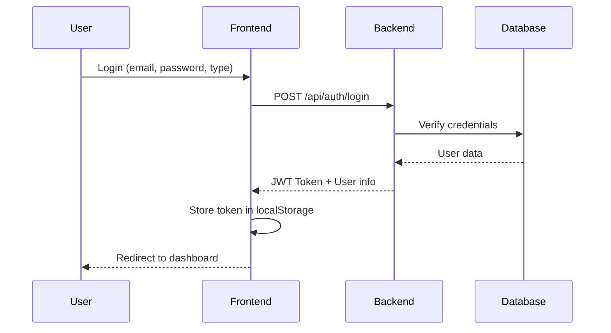
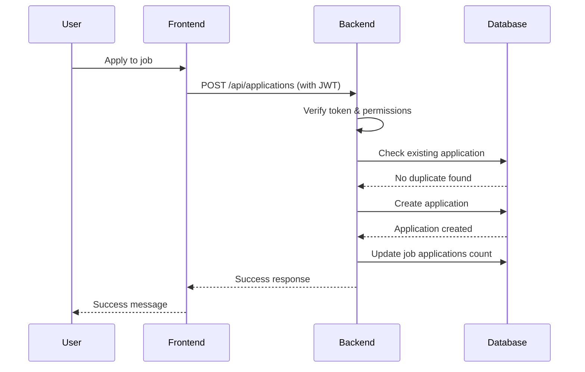

# 📖 Documentation Technique - InterimApp

## 📋 Table des Matières

1. [Vue d'Ensemble](#vue-densemble)
2. [Architecture Technique](#architecture-technique)
3. [Backend (API Flask)](#backend-api-flask)
4. [Frontend (React TypeScript)](#frontend-react-typescript)
5. [Base de Données (MongoDB)](#base-de-données-mongodb)
6. [Authentification et Sécurité](#authentification-et-sécurité)
7. [API Documentation](#api-documentation)
8. [Fonctionnalités Métier](#fonctionnalités-métier)
9. [Technologies Utilisées](#technologies-utilisées)
10. [Installation et Configuration](#installation-et-configuration)
11. [Tests et Qualité](#tests-et-qualité)
12. [Performance et Optimisation](#performance-et-optimisation)

---

## 🎯 Vue d'Ensemble

### **Contexte du Projet**
InterimApp est une plateforme web moderne de mise en relation entre candidats et entreprises pour l'emploi intérimaire. L'application permet aux utilisateurs de postuler à des offres d'emploi et aux entreprises de gérer leurs recrutements.

### **Objectifs**
- **Pour les Candidats**: Rechercher et postuler à des offres d'emploi
- **Pour les Entreprises**: Publier des offres et gérer les candidatures
- **Pour l'Écosystème**: Faciliter les rencontres professionnelles

### **Périmètre Fonctionnel**
```
┌─────────────────────────────────────────────────────────┐
│                    INTERIM APP                          │
├─────────────────────────────────────────────────────────┤
│ 👥 UTILISATEURS                                         │
│ • Inscription/Connexion multi-types                    │
│ • Gestion de profils                                   │
│ • Tableau de bord personnalisé                         │
├─────────────────────────────────────────────────────────┤
│ 💼 EMPLOIS                                              │
│ • Recherche avancée avec filtres                       │
│ • Publication d'offres (entreprises)                   │
│ • Gestion du cycle de vie des offres                   │
├─────────────────────────────────────────────────────────┤
│ 📝 CANDIDATURES                                         │
│ • Système de candidature en un clic                    │
│ • Suivi du statut en temps réel                        │
│ • Gestion des candidatures (entreprises)               │
└─────────────────────────────────────────────────────────┘
```

---

## 🏗️ Architecture Technique

### **Architecture Globale**
```
┌─────────────────┐    ┌─────────────────┐    ┌─────────────────┐
│   Frontend      │    │   Backend       │    │   Database      │
│                 │    │                 │    │                 │
│ React 18        │◄──►│ Flask 2.3       │◄──►│ MongoDB 5.0     │
│ TypeScript      │    │ Python 3.9      │    │ Cloud Atlas     │
│ Tailwind CSS    │    │ RESTful API     │    │ 512MB Free      │
│ React Router    │    │ JWT Auth        │    │                 │
│                 │    │ Swagger Docs    │    │                 │
└─────────────────┘    └─────────────────┘    └─────────────────┘
       │                        │                        │
       │                        │                        │
   Netlify                  Railway                 MongoDB Atlas
  (Frontend)               (Backend)                 (Database)
```

### **Patterns Architecturaux**
- **Frontend**: Component-Based Architecture (React)
- **Backend**: MVC Pattern avec Repository Pattern
- **API**: RESTful avec ressources bien définies
- **Database**: Document-Oriented avec relations

### **Flux de Données**
```
User Action → React Component → Context/State → API Call → Flask Route → Model/Database → Response → UI Update
```

---

## ⚙️ Backend (API Flask)

### **Structure du Backend**
```
backend/
├── app/
│   ├── __init__.py          # Application factory
│   ├── config.py            # Configuration
│   ├── database.py          # MongoDB connection
│   ├── models/              # Data models
│   │   ├── user.py         # User model
│   │   ├── company.py      # Company model
│   │   ├── job.py          # Job model
│   │   └── application.py  # Application model
│   ├── routes/              # API endpoints
│   │   ├── auth.py         # Authentication routes
│   │   ├── users.py        # User management
│   │   ├── companies.py    # Company management
│   │   ├── jobs.py         # Job management
│   │   └── applications.py # Application management
│   └── auth/                # Authentication logic
│       └── __init__.py     # JWT helpers
├── scripts/                 # Utility scripts
│   ├── seed_db.py          # Database seeding
│   └── clear_db.py         # Database cleanup
├── requirements.txt         # Python dependencies
├── app.py                  # Application entry point
└── Dockerfile              # Container configuration
```

### **Modèles de Données**

#### **User Model**
```python
class User:
    - email: str (unique)
    - password: str (hashed with bcrypt)
    - nom: str
    - prenom: str
    - telephone: str (optional)
    - competences: List[str]
    - experience: str
    - cv_url: str (optional)
    - date_creation: datetime
    - date_modification: datetime
    - actif: bool
```

#### **Company Model**
```python
class Company:
    - email: str (unique)
    - password: str (hashed with bcrypt)
    - nom: str
    - description: str
    - secteur: str (optional)
    - adresse: str (optional)
    - telephone: str (optional)
    - site_web: str (optional)
    - date_creation: datetime
    - date_modification: datetime
    - actif: bool
```

#### **Job Model**
```python
class Job:
    - company_id: ObjectId (reference to Company)
    - titre: str
    - description: str
    - salaire: str (optional)
    - type_contrat: str (CDI, CDD, Interim, etc.)
    - localisation: str (optional)
    - competences_requises: List[str]
    - experience_requise: str (optional)
    - date_creation: datetime
    - date_modification: datetime
    - actif: bool
    - candidatures_count: int
```

#### **Application Model**
```python
class Application:
    - user_id: ObjectId (reference to User)
    - job_id: ObjectId (reference to Job)
    - company_id: ObjectId (reference to Company)
    - lettre_motivation: str
    - statut: str (En attente, Acceptée, Refusée)
    - date_candidature: datetime
    - date_modification: datetime
    - notes_entreprise: str (optional)
```

### **API Endpoints**

#### **Authentication (`/api/auth`)**
```python
POST   /register/user     # User registration
POST   /register/company  # Company registration  
POST   /login            # Login (both types)
POST   /logout           # Logout
GET    /verify           # Token verification
PUT    /change-password  # Password change
```

#### **Users (`/api/users`)**
```python
GET    /                 # List all users (paginated)
GET    /{user_id}        # Get user by ID
POST   /                 # Create user (admin)
PUT    /{user_id}        # Update user (self only)
DELETE /{user_id}        # Delete user (self only)
GET    /{user_id}/profile # Get complete user profile
```

#### **Companies (`/api/companies`)**
```python
GET    /                    # List all companies (paginated)
GET    /{company_id}        # Get company by ID
POST   /                    # Create company (admin)
PUT    /{company_id}        # Update company (self only)
DELETE /{company_id}        # Delete company (self only)
GET    /{company_id}/profile # Get complete company profile
GET    /{company_id}/jobs   # Get company's jobs
```

#### **Jobs (`/api/jobs`)**
```python
GET    /                    # List all jobs (with search/filters)
GET    /{job_id}           # Get job by ID
POST   /                   # Create job (company only)
PUT    /{job_id}           # Update job (company owner only)
DELETE /{job_id}           # Delete job (company owner only)
PUT    /{job_id}/deactivate # Deactivate job
GET    /{job_id}/applications # Get job applications (company only)
```

#### **Applications (`/api/applications`)**
```python
GET    /                         # List applications (filtered by user type)
GET    /{application_id}         # Get application by ID
POST   /                         # Create application (user only)
PUT    /{application_id}         # Update application
DELETE /{application_id}         # Delete application
PUT    /{application_id}/status  # Update status (company only)
GET    /statistics              # Get statistics
GET    /user/{user_id}          # Get user's applications
GET    /company/{company_id}    # Get company's applications
```

### **Sécurité Backend**
- **Authentification JWT** avec expiration
- **Hachage des mots de passe** avec bcrypt
- **Validation des entrées** avec marshmallow
- **CORS** configuré pour le frontend
- **Autorisations** basées sur les rôles
- **Indexes MongoDB** pour les performances

---

## 🎨 Frontend (React TypeScript)

### **Structure du Frontend**
```
frontend/
├── public/
│   ├── index.html
│   └── manifest.json
├── src/
│   ├── components/          # Composants réutilisables
│   │   └── Navbar.tsx      # Navigation principale
│   ├── contexts/           # Context API
│   │   ├── AuthContext.tsx # Gestion authentification
│   │   └── ThemeContext.tsx # Gestion thème dark/light
│   ├── pages/              # Pages de l'application
│   │   ├── Home.tsx        # Page d'accueil
│   │   ├── Login.tsx       # Connexion
│   │   ├── Register.tsx    # Inscription
│   │   ├── Jobs.tsx        # Liste des emplois
│   │   ├── UserDashboard.tsx    # Dashboard candidat
│   │   ├── CompanyDashboard.tsx # Dashboard entreprise
│   │   └── CreateJob.tsx   # Création d'offre
│   ├── App.tsx             # Composant racine
│   ├── index.tsx           # Point d'entrée
│   └── index.css           # Styles globaux
├── package.json            # Dépendances
├── tailwind.config.js      # Configuration Tailwind
├── tsconfig.json          # Configuration TypeScript
└── Dockerfile             # Container configuration
```

### **Technologies Frontend**
- **React 18** avec Hooks et Context API
- **TypeScript** pour la sécurité des types
- **React Router 6** pour la navigation
- **Tailwind CSS** pour le styling
- **Axios** pour les appels API
- **Lucide React** pour les icônes

### **Composants Principaux**

#### **AuthContext**
```typescript
interface AuthContextType {
  user: User | null;
  login: (email: string, password: string, userType: 'user' | 'company') => Promise<boolean>;
  logout: () => void;
  isLoading: boolean;
}
```

#### **ThemeContext**
```typescript
interface ThemeContextType {
  theme: 'light' | 'dark';
  toggleTheme: () => void;
}
```

### **Gestion d'État**
- **Context API** pour l'état global (auth, theme)
- **useState/useEffect** pour l'état local
- **Custom hooks** pour la logique réutilisable

### **Routing**
```typescript
Routes:
/                    → Home
/login              → Login
/register           → Register  
/jobs               → Jobs (public)
/user/dashboard     → UserDashboard (private)
/company/dashboard  → CompanyDashboard (private)
/jobs/create        → CreateJob (company only)
```

---

## 🗄️ Base de Données (MongoDB)

### **Collections**

#### **users**
```javascript
{
  _id: ObjectId,
  email: String (unique),
  password: String (hashed),
  nom: String,
  prenom: String,
  telephone: String,
  competences: [String],
  experience: String,
  cv_url: String,
  date_creation: Date,
  date_modification: Date,
  actif: Boolean
}
```

#### **companies**
```javascript
{
  _id: ObjectId,
  email: String (unique),
  password: String (hashed),
  nom: String,
  description: String,
  secteur: String,
  adresse: String,
  telephone: String,
  site_web: String,
  date_creation: Date,
  date_modification: Date,
  actif: Boolean
}
```

#### **jobs**
```javascript
{
  _id: ObjectId,
  company_id: ObjectId (ref: companies),
  titre: String,
  description: String,
  salaire: String,
  type_contrat: String,
  localisation: String,
  competences_requises: [String],
  experience_requise: String,
  date_creation: Date,
  date_modification: Date,
  actif: Boolean,
  candidatures_count: Number
}
```

#### **applications**
```javascript
{
  _id: ObjectId,
  user_id: ObjectId (ref: users),
  job_id: ObjectId (ref: jobs),
  company_id: ObjectId (ref: companies),
  lettre_motivation: String,
  statut: String, // "En attente", "Acceptée", "Refusée"
  date_candidature: Date,
  date_modification: Date,
  notes_entreprise: String
}
```

### **Indexes Optimisés**
```javascript
// Performance indexes
users: { email: 1 } (unique)
companies: { email: 1 } (unique), { nom: 1 }
jobs: { company_id: 1 }, { titre: 1 }, { actif: 1 }, { date_creation: -1 }
applications: { user_id: 1 }, { job_id: 1 }, { company_id: 1 }, 
              { user_id: 1, job_id: 1 } (unique), { date_candidature: -1 }
```

### **Relations et Intégrité**
```
Users (1) ←→ (N) Applications (N) ←→ (1) Jobs (N) ←→ (1) Companies
```

---

## 🔐 Authentification et Sécurité

### **Système d'Authentification**
```python
# JWT Token Structure
{
  "user_id": "string",
  "user_type": "user|company", 
  "exp": timestamp,
  "iat": timestamp
}
```

### **Middleware de Sécurité**
```python
@login_required        # Authentification requise
@company_required      # Réservé aux entreprises
```

### **Hashage des Mots de Passe**
```python
# Utilisation de bcrypt avec salt
password_hash = bcrypt.hashpw(password.encode('utf-8'), bcrypt.gensalt())
```

### **Validation des Données**
```python
# Email validation
pattern = r'^[a-zA-Z0-9._%+-]+@[a-zA-Z0-9.-]+\.[a-zA-Z]{2,}

# Password validation  
min_length = 6 characters
```

### **CORS Configuration**
```python
CORS(app, origins=[
    "http://localhost:3000",      # Development
    "https://app.netlify.app",    # Production
])
```

---

## 📚 API Documentation

### **Swagger/OpenAPI**
- **URL**: `/apidocs/`
- **Format**: OpenAPI 2.0
- **Features**: Interactive testing, request/response examples

### **Authentication Flow**


### **Job Application Flow**


---

## 💼 Fonctionnalités Métier

### **Gestion des Utilisateurs**
```
┌─────────────────────────────────────────┐
│ CANDIDATS                               │
├─────────────────────────────────────────┤
│ ✅ Inscription avec profil complet      │
│ ✅ Gestion des compétences             │
│ ✅ Recherche d'emplois avec filtres    │
│ ✅ Candidature en un clic              │
│ ✅ Suivi des candidatures              │
│ ✅ Dashboard personnalisé              │
│ ✅ Statistiques personnelles           │
└─────────────────────────────────────────┘

┌─────────────────────────────────────────┐
│ ENTREPRISES                             │
├─────────────────────────────────────────┤
│ ✅ Inscription avec profil entreprise   │
│ ✅ Publication d'offres d'emploi        │
│ ✅ Gestion du cycle de vie des offres   │
│ ✅ Réception des candidatures          │
│ ✅ Acceptation/Refus des candidats     │
│ ✅ Dashboard de gestion                │
│ ✅ Statistiques de recrutement         │
└─────────────────────────────────────────┘
```

### **Workflow Complet**
```
1. INSCRIPTION
   User/Company → Validation → Compte créé

2. PUBLICATION (Entreprise)
   Formulaire → Validation → Offre publiée → Visible candidats

3. CANDIDATURE (Candidat)  
   Recherche → Sélection → Candidature → Notification entreprise

4. TRAITEMENT (Entreprise)
   Réception → Évaluation → Décision → Notification candidat

5. SUIVI
   Dashboard → Statistiques → Historique
```

### **Règles Métier**
- Un candidat ne peut postuler qu'une fois par offre
- Seules les entreprises peuvent publier des offres
- Les offres inactives ne sont pas visibles aux candidats
- Les candidatures sont automatiquement "En attente"
- Seule l'entreprise propriétaire peut modifier ses offres

---

## 🛠️ Technologies Utilisées

### **Backend Technologies**
```python
# Core Framework
Flask 2.3.3                  # Web framework
Flask-RESTful 0.3.10        # REST API extensions
Flask-CORS 4.0.0            # Cross-origin requests

# Database
pymongo 4.5.0               # MongoDB driver
python-dotenv 1.0.0         # Environment variables

# Documentation  
flasgger 0.9.7.1            # Swagger/OpenAPI

# Security
bcrypt 4.0.1                # Password hashing
PyJWT 2.8.0                 # JSON Web Tokens

# Validation
marshmallow 3.20.1          # Data validation
email-validator 2.0.0       # Email validation
```

### **Frontend Technologies**
```json
{
  "core": {
    "react": "^18.2.0",
    "typescript": "^4.9.0", 
    "react-dom": "^18.2.0"
  },
  "routing": {
    "react-router-dom": "^6.8.0"
  },
  "http": {
    "axios": "^1.3.0"
  },
  "ui": {
    "tailwindcss": "^3.2.0",
    "lucide-react": "^0.263.1"
  },
  "build": {
    "react-scripts": "5.0.1"
  }
}
```

### **Infrastructure**
```yaml
Database: MongoDB 5.0 (Atlas Cloud)
Containerization: Docker & Docker Compose
Frontend Hosting: Netlify / Vercel
Backend Hosting: Railway / Render
Monitoring: Built-in platform tools
SSL: Automatic (Let's Encrypt)
CDN: Integrated with hosting platforms
```

---

## 🚀 Installation et Configuration

### **Prérequis**
```bash
# Système
- Docker & Docker Compose
- Node.js 18+ 
- Python 3.9+
- Git

# Comptes (pour déploiement)
- GitHub account
- MongoDB Atlas account  
- Netlify/Vercel account
- Railway/Render account
```

### **Installation Locale**
```bash
# 1. Clone du repository
git clone https://github.com/votre-repo/interim_app.git
cd interim_app

# 2. Démarrage avec Docker
make up
# ou
docker-compose up --build

# 3. Peuplement de la base de données
make seed

# 4. Démarrage frontend (développement)
cd frontend
npm install
npm start
```

### **Variables d'Environnement**
```bash
# Backend (.env)
FLASK_ENV=development
MONGODB_URL=mongodb://localhost:27017/interim_app
JWT_SECRET_KEY=your-jwt-secret
SECRET_KEY=your-flask-secret

# Frontend (.env)
REACT_APP_API_URL=http://localhost:5000
REACT_APP_ENV=development
```

### **Commandes Make Disponibles**
```bash
make help          # Afficher l'aide
make up            # Démarrer tous les services
make down          # Arrêter tous les services  
make seed          # Peupler la base de données
make clear-db      # Vider la base de données
make reset-db      # Vider et repeupler
make logs          # Voir les logs
make shell         # Accéder au container backend
make health        # Vérifier l'état des services
```

---

## 🧪 Tests et Qualité

### **Types de Tests**
```
┌─────────────────────────────────────┐
│ TESTS BACKEND                       │
├─────────────────────────────────────┤
│ 🧪 Unit Tests (Models)              │
│ 🔗 Integration Tests (API)          │
│ 🔐 Security Tests (Auth)            │
│ 📊 Performance Tests (Database)     │
└─────────────────────────────────────┘

┌─────────────────────────────────────┐
│ TESTS FRONTEND                      │
├─────────────────────────────────────┤
│ ⚛️ Component Tests (React)          │
│ 🎯 E2E Tests (User journeys)        │
│ 📱 Responsive Tests (Mobile)        │
│ ♿ Accessibility Tests (A11y)        │
└─────────────────────────────────────┘
```

### **Qualité Code**
```python
# Backend Code Quality
- Type hints (Python 3.9+)
- Docstrings for all functions
- PEP 8 compliance
- Error handling avec try/catch
- Logging structuré

# Frontend Code Quality  
- TypeScript strict mode
- ESLint configuration
- Prettier formatting
- Component-based architecture
- Custom hooks for logic reuse
```

### **Métriques de Performance**
```
Backend:
- Response time: < 200ms (95th percentile)
- Throughput: 1000+ requests/minute
- Memory usage: < 512MB
- Database queries: Optimized with indexes

Frontend:  
- First Contentful Paint: < 1.5s
- Largest Contentful Paint: < 2.5s
- Cumulative Layout Shift: < 0.1
- Bundle size: < 1MB gzipped
```

---

## ⚡ Performance et Optimisation

### **Optimisations Backend**
```python
# Database Optimization
- Compound indexes for frequent queries
- Pagination for large result sets  
- Aggregation pipelines for statistics
- Connection pooling

# API Optimization
- Response compression (gzip)
- Caching headers for static content
- Efficient serialization
- Batch operations where possible
```

### **Optimisations Frontend**
```typescript
// Code Splitting
const UserDashboard = lazy(() => import('./pages/UserDashboard'));

// Memoization
const MemoizedComponent = React.memo(ExpensiveComponent);

// Debouncing for search
const debouncedSearch = useCallback(
  debounce((term) => searchJobs(term), 300),
  []
);

// Image optimization

```

### **Optimisations Infrastructure**
```yaml
Frontend:
  - Static asset optimization
  - CDN distribution  
  - Image compression
  - HTTP/2 support

Backend:
  - Container optimization
  - Environment-specific configs
  - Health checks
  - Horizontal scaling ready

Database:
  - Index optimization
  - Query performance monitoring
  - Automated backups
  - Read replicas (if needed)
```

---

## 📊 Métriques et Monitoring

### **KPIs Fonctionnels**
```
👥 Utilisateurs:
- Inscriptions par jour
- Taux de conversion inscription → première candidature
- Utilisateurs actifs (DAU/MAU)

💼 Emplois:
- Offres publiées par jour
- Taux de pourvoi des offres
- Temps moyen de recrutement

📝 Candidatures:
- Candidatures envoyées par jour  
- Taux d'acceptation
- Temps de réponse moyen des entreprises
```

### **KPIs Techniques**
```
🚀 Performance:
- Temps de réponse API (P95 < 200ms)
- Disponibilité (SLA 99.9%)
- Erreurs 5xx (< 0.1%)

💾 Base de données:
- Temps de requête (P95 < 50ms)
- Utilisation disque
- Connexions actives

🎨 Frontend:
- Core Web Vitals
- Bounce rate
- Page load time
```

---

## 🎯 Roadmap et Évolutions

### **Version Actuelle (v1.0)**
```
✅ Authentification multi-types
✅ CRUD complet pour toutes les entités
✅ Interface responsive
✅ API documentée
✅ Containerization Docker
✅ Déploiement cloud ready
```

### **Prochaines Versions**

#### **v1.1 - Améliorations UX**
```
🔮 Notifications en temps réel
🔮 Upload de CV/documents
🔮 Chat intégré entreprise-candidat
🔮 Système de notation/avis
```

#### **v1.2 - Intelligence**
```
🔮 Matching automatique candidat-offre
🔮 Recommandations personnalisées
🔮 Analytics avancées
🔮 API publique pour partenaires
```

#### **v2.0 - Marketplace**
```
🔮 Système de paiement
🔮 Abonnements entreprises
🔮 API mobile
🔮 Multi-localisation
```

---

## 📞 Support et Maintenance

### **Documentation Technique**
- **API Docs**: Swagger UI accessible via `/apidocs`
- **Code Comments**: Inline documentation
- **README**: Instructions de démarrage
- **CHANGELOG**: Historique des versions

### **Logs et Debugging**
```bash
# Logs de développement
docker-compose logs -f backend
docker-compose logs -f frontend

# Logs de production
railway logs          # Backend
netlify functions:log # Frontend
```

### **Monitoring Production**
```
🔍 Application Performance Monitoring (APM)
📊 Business Intelligence Dashboard  
🚨 Alerting système (email/Slack)
📈 Usage analytics
🔐 Security monitoring
```

---

## 🎉 Conclusion

InterimApp est une application web moderne et complète qui démontre l'implémentation réussie d'une plateforme de recrutement. Elle combine les meilleures pratiques de développement web avec une architecture scalable et maintenable.

### **Points Forts du Projet**
- **Architecture moderne** avec separation claire des responsabilités
- **Sécurité robuste** avec authentification JWT et validation des données
- **UX/UI soignée** avec thème dark/light et responsive design
- **Performance optimisée** avec indexes database et code splitting
- **Déploiement simplifié** avec Docker et cloud-ready configuration
- **Documentation complète** pour faciliter la maintenance et évolution

### **Valeur Métier**
- **ROI mesurable** avec métriques de performance claires
- **Scalabilité** prête pour la croissance
- **Maintenabilité** grâce à l'architecture modulaire
- **Extensibilité** pour de futures fonctionnalités

**Cette documentation technique serve de référence complète pour le développement, déploiement, et maintenance de l'application InterimApp.**